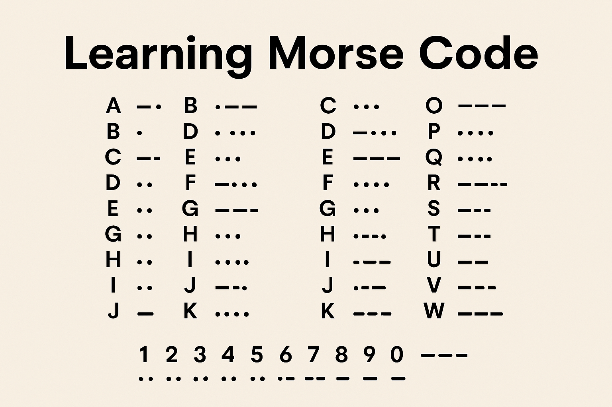

# The beauty of `f(x)`

Longer title should likely be `"The beauty of pure functions and streams"`.

Demo: [beauty-of-f.netlify.app](https://beauty-of-f.netlify.app/)

## History

> One of the Morse code systems was invented in the United States by American artist and inventor Samuel F.B. Morse during the 1830s for electrical telegraphy. A variant called the International Morse Code was devised by a conference of European nations in 1851 to account for letters with diacritic marks

## The theory of Morse Code

Please read the [Morse code](https://en.wikipedia.org/wiki/Morse_code) on Wikipedia.



# Examples

This presentation uses [just] build system and [scala-cli] to build and run examples.

## 1. Encoding

Example in the plain and simple Scala 3: [`MorseEncode.scala`](./src/MorseEncode.scala)

### Basic Morse code encoding

```bash
just encode "SOS SOS SCALA"
# ...---... ...---... ...-.-..-.-...-
```

### Attempt to convert it to "sound"

```bash
just dib-say "SOS SOS SCALA"

# dit dit dit dah dah dah dit dit dit  dit dit dit dah dah dah dit dit dit  dit dit dit dah dit dah dit dit dah dit dah dit dit dit dah
```

### Other symbols?

```bash
just cur-say "SOS SOS OTO BRGLEZ"

# ( ( ( ) ) ) ( ( (  ( ( ( ) ) ) ( ( (  ) ) ) ) ) ) )  ) ( ( ( ( ) ( ) ) ( ( ) ( ( ( ) ) ( (
```

### Send it to "Alex"

Alex is one of the voices available on macOS with the [`say` command](https://ss64.com/mac/say.html).

```bash
just say "SOS SOS RUBY"

# [ sound ]
```

## Encoding to sound

We encode with [Pulse-code modulation (PCM)](https://en.wikipedia.org/wiki/Pulse-code_modulation) using [
`javax.sound.sampled.*`](https://docs.oracle.com/javase/8/docs/api/javax/sound/sampled/package-summary.html)

### Encode into a WAV file

```bash
just encode-sound "SOS SOS RUBY"

# OUTPUT: ... --- ...   ... --- ...   .-. ..- -... -.--
# FILE: /Users/oto/Projects/beauty-of-f/output.wav
```

### Encode and play with `afplay`

We'll encode and then play with OSX [`afplay` - Audio File Play.](https://ss64.com/mac/afplay.html)

```bash
just encode-play "SOS SOS RUBY"

# OUTPUT: ... --- ...   ... --- ...   .-. ..- -... -.--
# FILE: /Users/oto/Projects/beauty-of-f/output-play.wav
# [ hopefully sound ]
```

### Encode and play with Java SDK

```bash
just play-play "SOS SOS RUBY"
```

## UI

```bash
just build-js
just serve-js
```

# Deployment

```bash
just deploy
```

[just]: https://github.com/casey/just
[scala-cli]: https://scala-cli.virtuslab.org/
